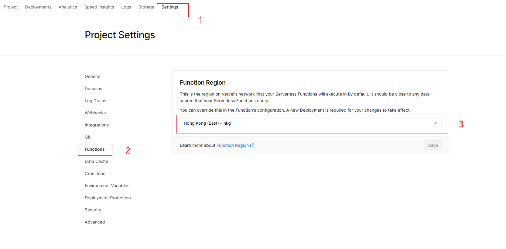
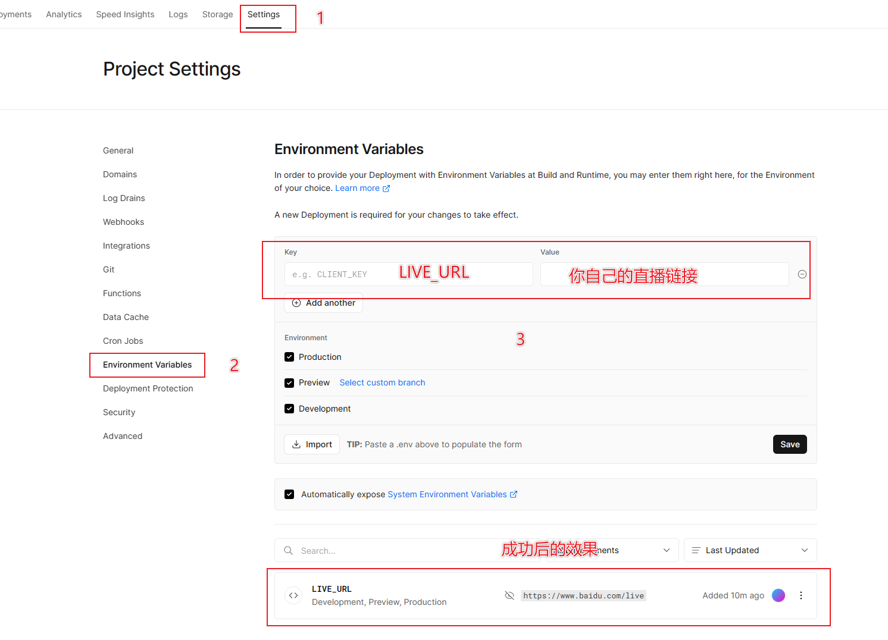
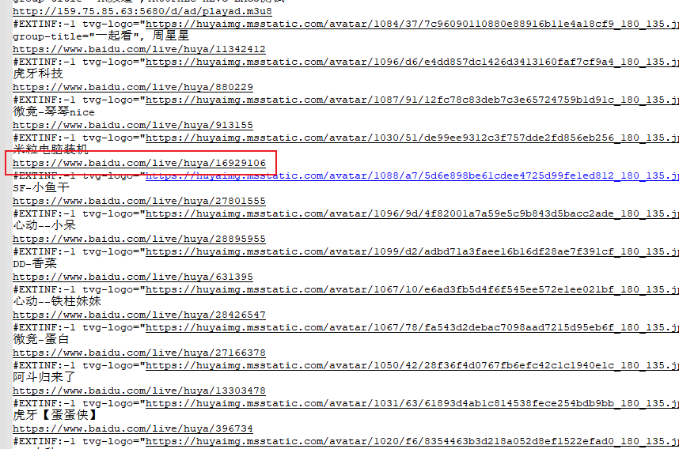

# iptv-go
使用 [Vercel](https://vercel.com/) 部署 [https://github.com/youshandefeiyang/LiveRedirect](https://github.com/youshandefeiyang/LiveRedirect) 的 [Golang脚本](https://github.com/youshandefeiyang/LiveRedirect/tree/main/Golang/liveurls)

部署后详细使用说明参考: [https://github.com/youshandefeiyang/LiveRedirect/blob/main/Golang/README.md](https://github.com/youshandefeiyang/LiveRedirect/blob/main/Golang/README.md)

## 部署

### 方式一（推荐）

点击下方按钮一键部署，还没注册的可以选择github登陆然后绑定手机即可

### ~~方式二~~

没必要fork了，一键部署更方便

1. Fork项目到自己的仓库
2. 在Vercel创建Project并选择`iptv-go`
3. Build&Deploy
4. Enjoy~

## ~~访问路径~~

现在访问路径不需要加多一层了，和肥羊仓库的方式一致，如果是以前部署的，也不需要改，也是正常用的

### 直播

`https://<你的域名>/live/平台/id`

> 注意路径多了一层`live`

### 一起看

`https://<你的域名>/yqk/xxx.m3u`

> 注意路径多了一层`yqk`

## 高级设置

 1. Vercel的Function Region设置为香港服务器看直播可以延迟会低一点
 
 > 设置完需要重新部署生效

其他可选设置

 1. Vercel分配的子域名访问有困难的话可以自定义域名`CNAME`到[cname-china.vercel-dns.com](cname-china.vercel-dns.com)
 > 非必要步骤且需要有自己的域名

 2. 设置Vercel的环境变量`LIVE_URL`可以替换返回的m3u直播链接，就不用通过请求连接的`url`参数设置了
 > 非必要步骤
 >
 > 例如设置环境变量为: `https://www.baidu.com/live`
 > 
 > 返回文件的效果
 > 
 > 
 > 优先级：链接的`url`参数 > 环境变量`LIVE_URL` > 默认域名

